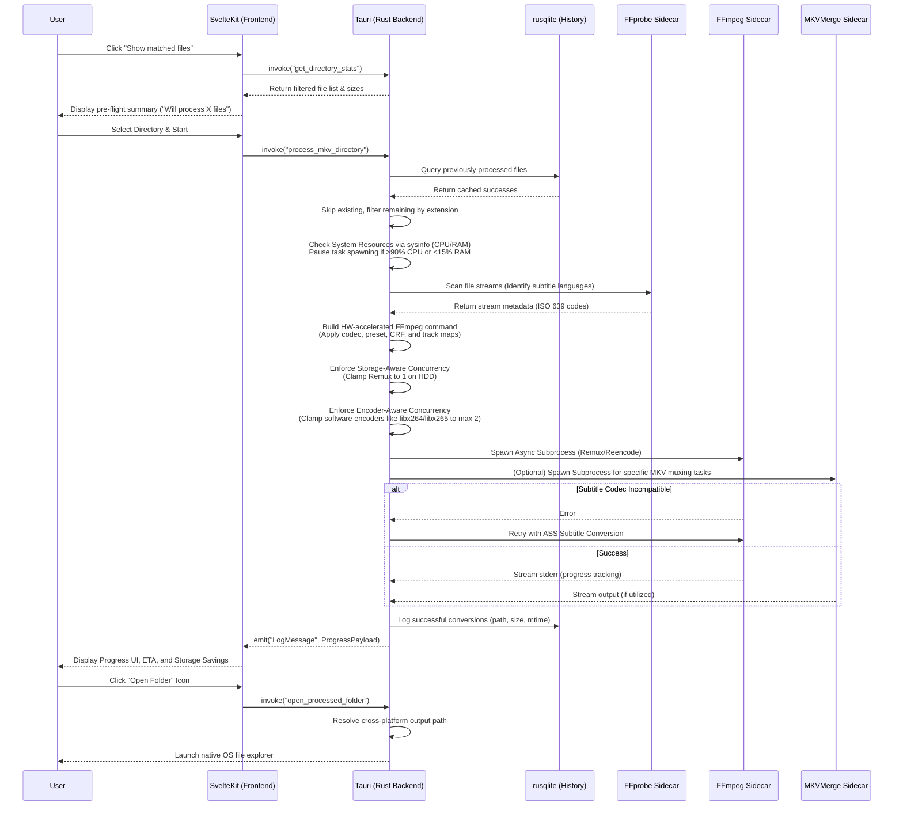

# 🧠 Knowledge Graph

This graph illustrates the system architecture and data flow between the decoupled Svelte frontend and the Tauri Rust backend for the **MKV Filter Metadata** project.

## Processing Pipeline Flow

