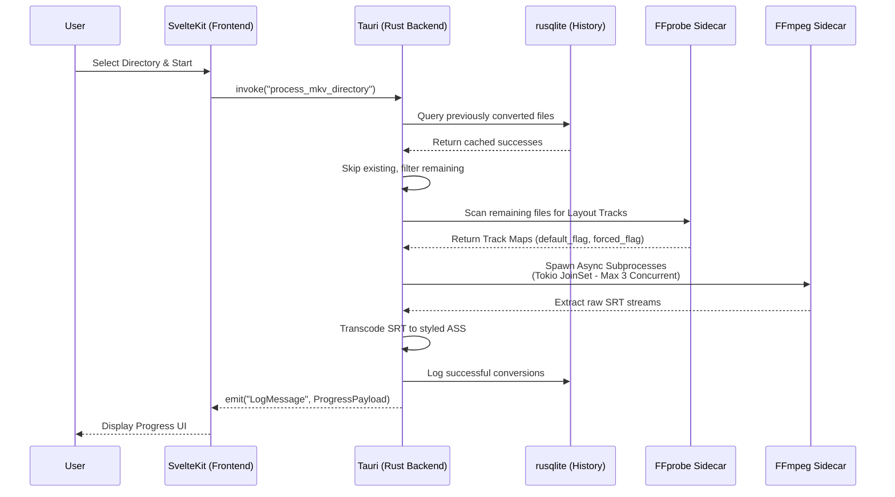

# 🧠 Knowledge Graph

This graph illustrates the system architecture and data flow between the decoupled Svelte frontend and the Tauri Rust backend.

## Subtitle Processing Flow



## CI/CD Pipeline

```mermaid
graph TD
    Push[Code Push / Pull Request] --> Dispatch(GitHub Actions)
    
    subgraph Composite Action [setup-environment]
        OSDeps[Install OS Deps]
        NodeSetup[Setup Node/pnpm]
        RustSetup[Setup Rust Toolchain & Cache]
        Deps[pnpm install & prebuild]
        
        OSDeps --> NodeSetup
        NodeSetup --> RustSetup
        RustSetup --> Deps
    end
    
    Dispatch --> Composite Action
    
    Composite Action --> Lint[Lint & Check]
    Composite Action --> TestUbuntu[Test & Coverage Ubuntu]
    Composite Action --> TestWin[Test Windows]
    Composite Action --> TestMac[Test macOS]
    Composite Action --> Build[Build Validation]
```
